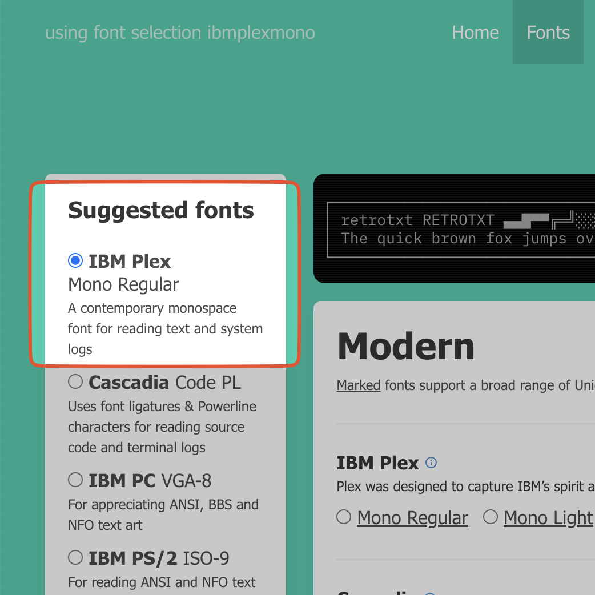
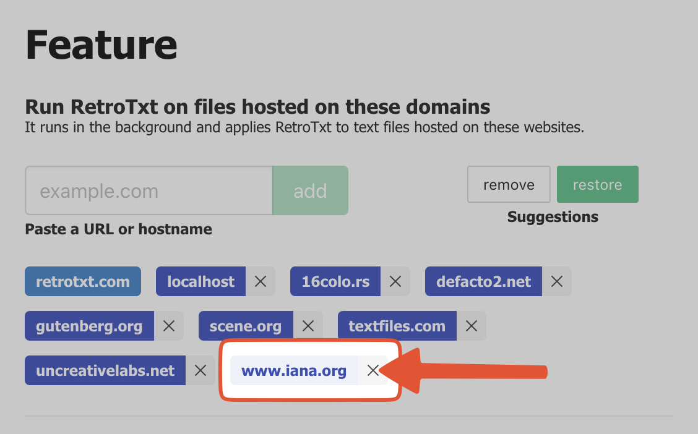

---
hide:
---
# First-time usage

!!! warning inline end "Read and change all data"
    Despite this access, __RetroTxt always ignores websites other than those you tell it to monitor in the background__. It also ignores all markup text, such as HTML or XML, for your privacy and overall browser performance.

    [If unrestricted access remains a worry, you can configure the browser to restrict RetroTxt further]().

## Add extension

On installation from the [Chrome web store](https://chrome.google.com/webstore/detail/retrotxt/gkjkgilckngllkopkogcaiojfajanahn) or [Microsoft Edge add-ons](https://microsoftedge.microsoft.com/addons/detail/retrotxt/hmgfnpgcofcpkgkadekmjdicaaeopkog), your browser will prompt for permission to read and change all data on all websites. Unfortunately, there is no workaround to avoid this.

<figure markdown>
  { loading=lazy, width=600 }
  <figcaption>Add "RetroTxt"? prompt to Add extension</figcaption>
</figure>

---

## New install

!!! question inline end "What is .ans?"
    The `.ans` filename extension signifies text files embedded with ANSI escape control characters for terminals to permit the layout and colorization of the text.

Once installed, you can test the functionality by viewing the RetroTxt ANSI logo hosted at:

[https://retrotxt.com/e/preview_02.ans](https://retrotxt.com/e/preview_02.ans)

<figure markdown>
  { loading=lazy, width=600 }
  <figcaption>RetroTxt ANSI logo in the tab</figcaption>
</figure>

---

## Hide the header

You can click the blue arrow on the upper-left corner to hide the header and remove the clutter.

<figure markdown>
  { loading=lazy, width=600 }
  <figcaption>A clutter free view</figcaption>
</figure>

---

## Original text

If you want to view the original ANSI document, focus on the tab and tap to launch a view source tab:

++ctrl++ <kbd>u</kbd> or ++command++ ++option++ <kbd>u</kbd>

<figure markdown>
  { loading=lazy, width=600 }
  <figcaption>RetroTxt logo raw text</figcaption>
</figure>

---

## Monitor a new website

This example shows how to add a new website to the collection that RetroTxt monitors in the background. In this case, we will use the Internet Assigned Numbers Authority website at [iana.org](https://www.iana.org), which hosts many documents in plain text.

In a tab, open the text document [special-use-domain-names.txt](https://www.iana.org/assignments/special-use-domain-names/special-use-domain-names.txt).

Despite being plain text, RetroTxt ignores the page as it is not monitoring [iana.org](https://www.iana.org).

<figure markdown>
  { loading=lazy, width=600 }
  <figcaption>Special use domain names text</figcaption>
</figure>

Click the RetroTxt toolbar button (shown below), and a popup will display the websites it monitors in the background. [You can learn more about or remove these websites]().

In the popup, click the blue _To include a new website_ button.

<figure markdown>
  { loading=lazy, width=600 }
  <figcaption>Special use domain names text</figcaption>
</figure>

Under __Feature__ `>` _Run RetroTxt on files hosted on these domains_ `>` _Paste a URL or hostname_ input, and __add__ the website:

[https://www.iana.org](www.iana.org)

<figure markdown>
  { loading=lazy, width=600 }
  <figcaption>Special use domain names text</figcaption>
</figure>

Switch back to the tab with the `special-use-domain-names.txt` text and reload. RetroTxt will now format the text!

!!! tip "Reload a tab"
    To reload or refresh a tab, use the keyboard <kbd>F5</kbd> key or ++command++ <kbd>r</kbd>

<figure markdown>
  { loading=lazy, width=600 }
  <figcaption>Special use domain names text</figcaption>
</figure>

---

## Change the font

Click the __Settings__ link in the information header and then the _Fonts_ tab.

Choose _IBM Plex_ from the _Suggested fonts_.

<figure markdown>
  { loading=lazy, width=600 }
  <figcaption>Special use domain names text</figcaption>
</figure>

Switch back to the tab with the `special-use-domain-names.txt` text, and the font will update.

<figure markdown>
  { loading=lazy, width=600 }
  <figcaption>Special use domain names using the IBM Plex mono font</figcaption>
</figure>

---

## Swap colors

Click the __Settings__ link and then the _Display_ tab.

Under __Colors__ `>` _Text pairs_, choose the _white on dark_ selection.

<figure markdown>
  { loading=lazy, width=600 }
  <figcaption>Special use domain names using the IBM Plex mono font</figcaption>
</figure>

!!! note inline end "ANSI text"
    A black background _Text pair_ works best with ANSI text.

Switch to the tab with the `special-use-domain-names.txt` text, and the page colors will reflect the change. Feel free to revert to the _MS-DOS_ color pair or choose another.

<figure markdown>
  { loading=lazy, width=600 }
  <figcaption>Special use domain names using the white on light color pair</figcaption>
</figure>

---

## Remove a website monitor

Finally, to remove the monitoring of [www.iana.org](https://www.iana.org). Click the RetroTxt toolbar button and also the blue, _To include a new website_ button.

<figure markdown>
  { loading=lazy, width=600 }
  <figcaption>Special use domain names text</figcaption>
</figure>

Click the __X__, delete button besides the [www.iana.org](https://www.iana.org) entry.

<figure markdown>
  { loading=lazy, width=300 }
  <figcaption>Special use domain names text</figcaption>
</figure>

Switch back to the  `special-use-domain-names.txt` text tab and reload. It should revert to the original, unformatted text.

<figure markdown>
  { loading=lazy, width=600 }
  <figcaption>Special use domain names text</figcaption>
</figure>

---

You can test the installation of RetroTxt by selecting one of the many sample artworks found in the RetroTxt Samples tab. Or type `txt samples` in an address bar.

<figure markdown>
  
  <figcaption>Omnibox txt samples command</figcaption>
</figure>
