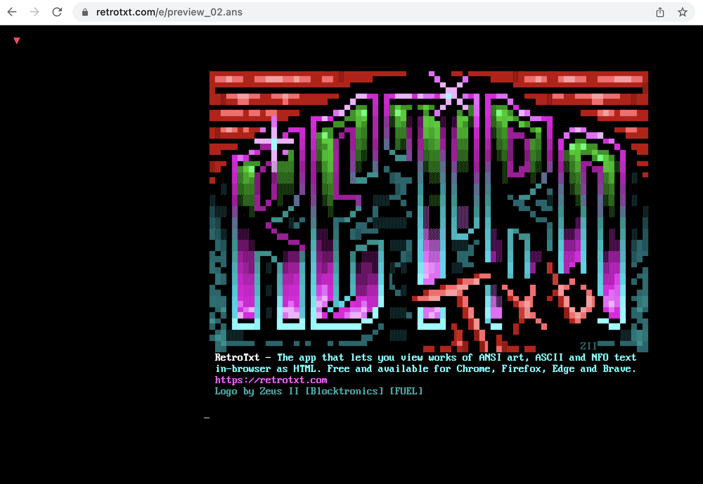
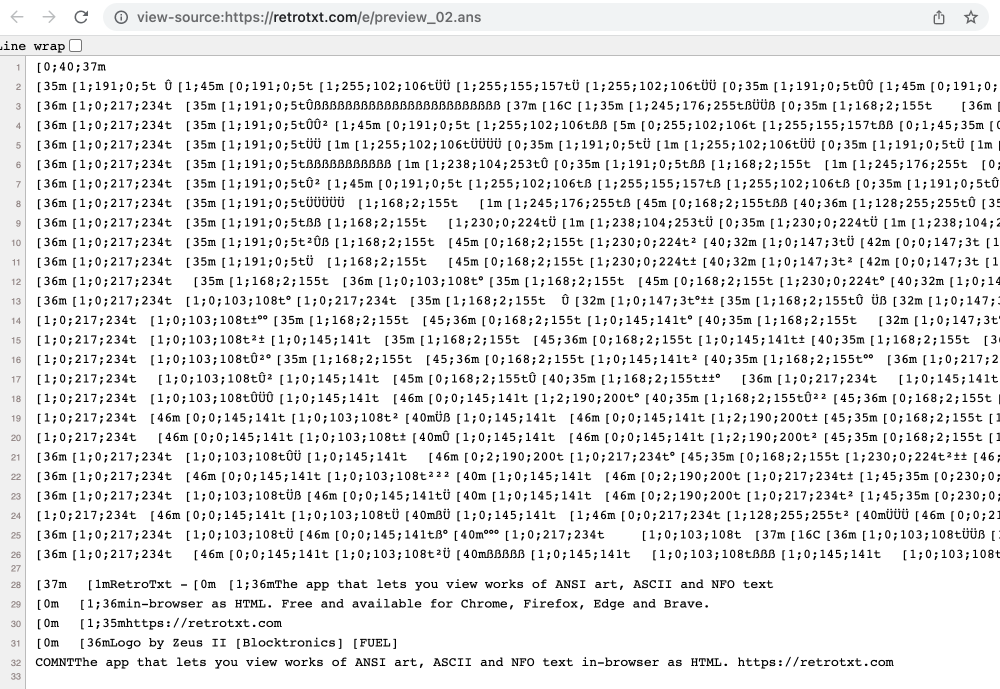
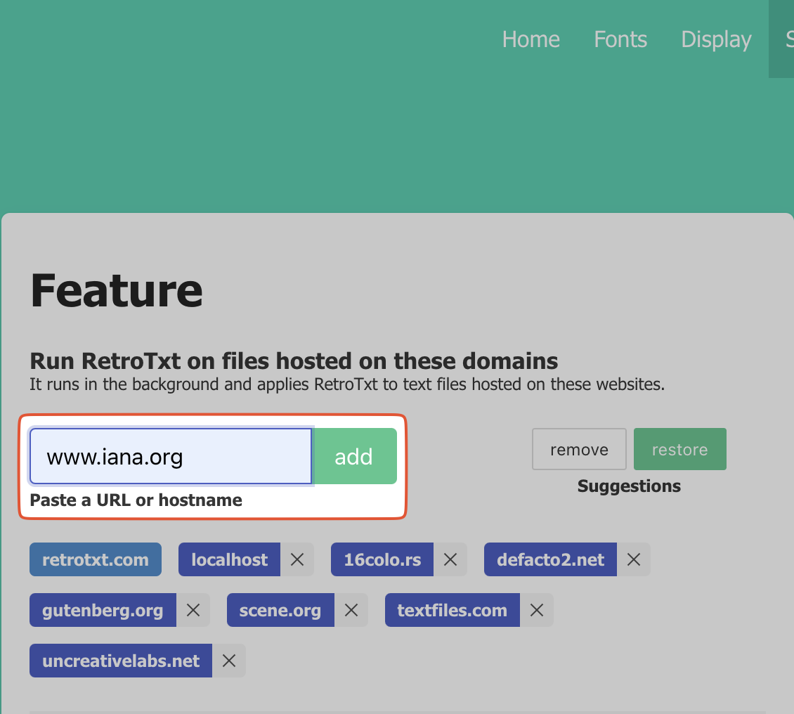
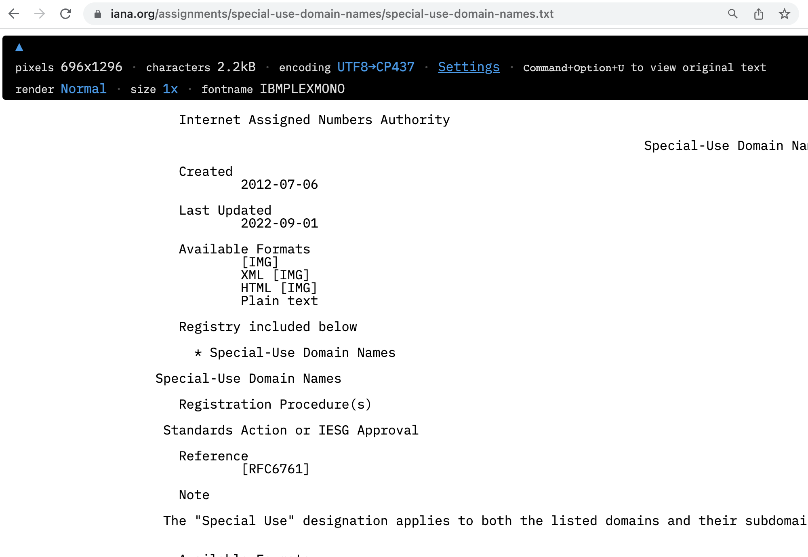

---
hide:
---
# First-time usage

!!! note inline end "Read and change all data"
    Despite this access, RetroTxt always ignores websites other than those you tell it to monitor in the background. It also ignores all markup text, such as HTML or XML, for your privacy and overall browser performance.

    If unrestricted access remains a worry, you can configure the browser to restrict RetroTxt further.

## Add extension

On installation from the [Chrome web store](https://chrome.google.com/webstore/detail/retrotxt/gkjkgilckngllkopkogcaiojfajanahn) or [Microsoft Edge add-ons](https://microsoftedge.microsoft.com/addons/detail/retrotxt/hmgfnpgcofcpkgkadekmjdicaaeopkog), your browser will prompt for permission to read and change all data on all websites. Unfortunately, there is no workaround to avoid this.

<figure markdown>
  { loading=lazy, width=600 }
  <figcaption>Add "RetroTxt"? prompt to Add extension</figcaption>
</figure>

## New install

!!! info inline end "What is .ans?"
    The `.ans` filename extension signifies text files embedded with ANSI escape control characters for terminals to permit the layout and colorization of the text.

Once installed, you can test the functionality by viewing the RetroTxt ANSI logo hosted at:

[https://retrotxt.com/e/preview_02.ans](https://retrotxt.com/e/preview_02.ans)

<figure markdown>
  { loading=lazy, width=600 }
  <figcaption>RetroTxt ANSI logo in the tab</figcaption>
</figure>

## Hide the header

You can click the blue arrow on the upper-left corner to hide the header and remove the clutter.

<figure markdown>
  { loading=lazy, width=600 }
  <figcaption>A clutter free view</figcaption>
</figure>

## Original text

If you want to view the original ANSI document, focus the tab and tap:

++ctrl++ <kbd>u</kbd> or ++command++ ++option++ <kbd>u</kbd>.

<figure markdown>
  { loading=lazy, width=600 }
  <figcaption>RetroTxt logo raw text</figcaption>
</figure>

## Monitor a new website

In a new tab, visit the [Internet Assigned Numbers Authority text documentation for _Special-Use Domain Names_](https://www.iana.org/assignments/special-use-domain-names/special-use-domain-names.txt).

Despite being a plain text document, RetroTxt ignores the page as it is not monitoring iana.org.

<figure markdown>
  { loading=lazy, width=600 }
  <figcaption>Special use domain names text</figcaption>
</figure>

Click the RetroTxt toolbar button, and a popup will display the websites it monitors in the background. You can learn more about these websites here...

In the popup, click the blue __To include a new website__ button.

<figure markdown>
  { loading=lazy, width=600 }
  <figcaption>Special use domain names text</figcaption>
</figure>

Under Feature > Run RetroTxt on files hosted on these domains > Paste a URL or hostname input, and add the website:

[https://www.iana.org](www.iana.org)

<figure markdown>
  { loading=lazy, width=600 }
  <figcaption>Special use domain names text</figcaption>
</figure>

Switch back to and reload ( <kbd>F5</kbd> or ++command++ <kbd>r</kbd> ) the tab with _Special-Use Domain Names_ text documentation, and RetroTxt will now format the text!

<figure markdown>
  { loading=lazy, width=600 }
  <figcaption>Special use domain names text</figcaption>
</figure>

## Change the font

Click the Settings link and then the Fonts tab.

Choose IBM Plex from the Suggested fonts.

<figure markdown>
  { loading=lazy, width=600 }
  <figcaption>Special use domain names text</figcaption>
</figure>

Switch back to the tab with the _Special-Use Domain Names_ document, and the text font will update.

<figure markdown>
  { loading=lazy, width=600 }
  <figcaption>Special use domain names using the IBM Plex mono font</figcaption>
</figure>

## Swap colors

Click the Settings link and then the Display tab.

Under Colors > Text pairs, choose the white on dark selection.

<figure markdown>
  { loading=lazy, width=600 }
  <figcaption>Special use domain names using the IBM Plex mono font</figcaption>
</figure>

Switch to the tab with the _Special-Use Domain Names_ document, and the text colors will reflect the change. Feel free to revert to the _MS-DOS_ color pair or choose another. Note that a black background works best with ANSI text.

<figure markdown>
  { loading=lazy, width=600 }
  <figcaption>Special use domain names using the white on light color pair</figcaption>
</figure>

## Remove a website monitor

Finally, to remove the monitoring of www.iana.org. Click the RetroTxt toolbar button and select the blue, _To include a new website_ button.

<figure markdown>
  { loading=lazy, width=600 }
  <figcaption>Special use domain names text</figcaption>
</figure>

Click the X delete button next to the www.iana.org cell.

<figure markdown>
  { loading=lazy, width=600 }
  <figcaption>Special use domain names text</figcaption>
</figure>

Switch back to the  _Special-Use Domain Names_  document tab and reload. It should revert to the original plain text document.

<figure markdown>
  { loading=lazy, width=600 }
  <figcaption>Special use domain names text</figcaption>
</figure>

---

You can test the installation of RetroTxt by selecting one of the many sample artworks found in the RetroTxt Samples tab. Or type `txt samples` in an address bar.

<figure markdown>
  
  <figcaption>Omnibox txt samples command</figcaption>
</figure>

---

RetroTxt initially runs on these preconfigured websites and domains.

- [retrotxt.com](https://retrotxt.com) 
Hosts the texts and artworks linked in the Samples tab
- [http://localhost](http://localhost) 
Permits the use of local and simple HTTP servers
- [16colo.rs](https://16colo.rs) 
The primary hub of the ANSI and ASCII art communities
- [defacto2.net](https://defacto2.net) 
An extensive collection of computer underground text art and documents
- [gutenberg.org](https://www.gutenberg.org) 
The world's most comprehensive collection of public domain books in plain text and other formats
- [scene.org](https://scene.org) 
The primary file hosting service for the demo scene
- [textfiles.com](http://textfiles.com) 
An extensive text file collection from the early Internet and BBS era
- [uncreativelabs.net](http://uncreativelabs.net) 
Retro computing texts and files

---

You can change these sites in the settings of RetroTxt, under the <strong>Run RetroTxt on files hosted on these domains</strong> within Feature. 
Or type `txt settings` in the browser address bar.