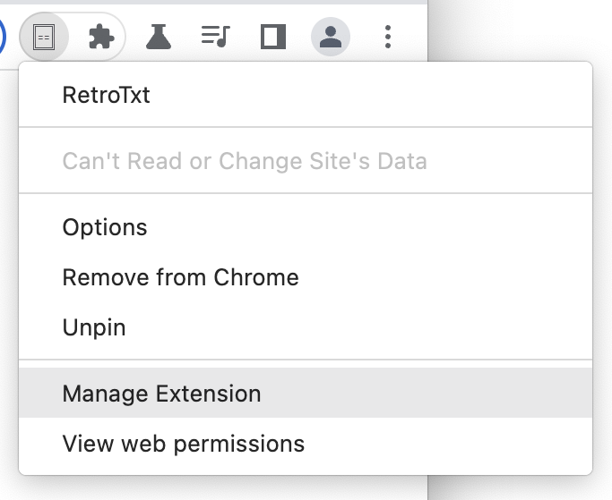

---
authors:
    - Ben Garrett
date: 2022-08-30
hide:
  - toc
---
# Texts stored locally

!!! question inline end "My text file does not open"
    Browsers a very inconsistent with the files they will open. If a text file has too many unexpected [ASCII control characters](https://www.fmsystems-inc.com/ascii-extended-control-characters/), a browser may confuse it with as binary file and refuse to open it.

Browsers are happy to display files stored locally on your computer.
You can drag and drop a text or document to the browser, which will open in a new tab.

The URL of the tab will point to the file path with a `file:///` protocol prefix. Windows also includes a drive letter.

=== "Windows"

    ``` title="A local file URL"
    file:///C:/Users/Ben/Downloads/document.txt
    ```
=== "macOS"

    ``` title="A local file URL"
    file:///Users/ben/Downloads/document.txt
    ```

=== "Linux"

    ``` title="A local file URL"
    file:///home/ben/Downloads/document.txt
    ```

RetroTxt is happy to work with any local file URL but needs to be given this permission using the Manage extension.

To access this, right-click the RetroTxt toolbar button and select _Manage extension_.

<figure markdown>
  { loading=lazy, width=400 }
  <figcaption>The RetroTxt button pinned to the toolbar</figcaption>
</figure>

Scroll down to and enable __Allow access to file URLs__ under _Permissions_.

Now, RetroTxt will monitor any local text files opened in the browser!

<figure markdown>
  { loading=lazy, width=600 }
  <figcaption>Allow access to the file URLs</figcaption>
</figure>
